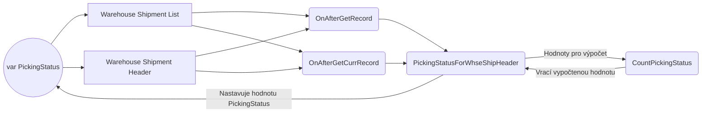

# API

> **A**pplication **P**rogramming **I**nterface je komunikační rozhraní, prostřednictvím kterého si mohou 2 různé aplikace vyměňovat data. API má například i internetové bankovnictví nebo ChatGPT. Když se na nějakou stránku přihlašuješ prostřednictvím facebooku nebo gmailu, tak tato stránka využívá API! Díky API tak můžeš ve své aplikaci využít data jiné aplikace. 


# API (page)

API page programujeme velmi podobným způsobem, jako klasickou page v BC. Jsou zde jen nové vlastnosti, které je nezbytné nastavit, a zároveň existují i nějaké typografické rozdíly.

__**Vlastnosti:**__
``` csharp
PageType = API;					        // Typ stránky = API
Caption = 'customer', Locked = true;	// Popis, Locked IDK ???????????????????????????????????????????????????????????????????
APIPublisher = 'navertica';			    // Publisher	
APIGroup = 'reporting';				    // Skupina API, která je pak součástí URL dotazu. Používá se pro nějaké logické dělení
APIVersion = 'v1.0';				    // Verze API
EntityName = 'customer';			    // Jednotné číslo entity
EntitySetName = 'customers';			// Množné číslo entity
SourceTable = Customer;				    // Zdrojová tabulka
DelayedInsert = true;				    // Povinná vlastnost na editovatelné API stránce (Editable = true). Funguje tak, že se nejprve zadají hodnoty všech polí a poté se záznam vloží najednou.
ODataKeyFields = SystemId;			    // Vlastnost, která říká, podle čeho bude jednoznačně identifikovatelný daný záznam. V případě API je doporučeno používat SystemId, neboť bude pro daný záznam vždy stejný. SystemId je nějaké ID generované BC.
Editable = false;				        // Editovatelná API page
InsertAllowed = false;				    // Povoleno vkládání záznamů
DeleteAllowed = false;				    // Povoleno odstraňování záznamů
ModifyAllowed = false;				    // Povolena modifikace záznamů
```

# Políčka na stránce

Zde nejsou žádné povinné vlastnosti. Název políčka, který bude viditelný na API page **musí začínat malým písmenem** - tzv. __**camelCasing**__.

``` csharp
layout
    {
        area(Content)
        {
            repeater(control1)
            {
                field(number; Rec."No.")
                {
                    Caption = 'number', Locked = true;
                }
                field(name; Rec.Name)
                {
                    Caption = 'name', Locked = true;
                }
                field(type; Rec."Contact Type")
                {
                    Caption = 'type', Locked = true;
                }
            }
        }
    }
```

## Povinná políčka na stránce
Existují 2 políčka, která **musí být vždy vytažena:**

    - Pole "SystemId" s názvem "id"
    - Pole **"SystemModifiedAt"** s názvem ```c#
    "lastModifiedDateTime"
    ``` 
    -

Zvolíme implementaci prostřednictvím vypočítaného políčka, které se bude zobrazovat pouze na konkrétních stránkách. **Nebudeme** tedy **vytvářet políčko (záznam) v tabulce**, jak jsme zvyklí. Na stránce vytvoříme proměnnou, kterou necháme zobrazit v políčku na této stránce. Na stránku přidáme triggery, při kterých dojde k vypočítání hodnoty této proměnné, jenž bude následně zobrazena.

Pro výpočet potřebujeme získat dodané množství a celkové množství, které má být dodáno. Tyto informace jsou naštěstí na řádcích dodávky ze skladu, čímž se nám vše opět zjednoduší. Pro danou hlavičku dodávky ze skladu pomocí filrů najdeme všechny řádky dodávky ze skladu. Ty pak projdeme a sečteme požadované hodnoty. 




Na stránku bude vytaženo políčko, jehož hodnota bude určena proměnnou **var PickingStatus**. Následně přidáme **triggery** **OnAfterGetRecord** a **OnAfterGetCurrRecord**, při kterých budeme volat vlastní funkci **PickingStatusForWhseShipHeader**. Tato funkce provede zmíněnou filtraci řádků dodávky ze skladu a získá potřebné hodnoty k výpočtu, které předá funkci **CountPickingStatus**, jenž výpočet realizuje a vrací vypočtenou hodnotu. Vypočtené hodnota je pak v (původní) funkci PickingStatusForWhseShipHeader přiřazena proměnné var PickingStatus, díky čemuž bude zobrazena na stránce.

> Běžný způsob je ten, že se v triggerech na stránce volá lokální procedura **SetCalculatedFields()**, ve které je pak implementován výpočet. V tomto případě by se tedy v této funkci mohla volat funkce **PickingStatusForWhseShipHeader**, která by vracela hodnotu získanou díky funkci **CountPickingStatus**.

## Vytvoření políčka na stránce
> Je třeba si připomenout, že pouze zobrazujeme hodnotu a **netvoříme žádný záznam v tabulce**!
``` csharp
pageextension 80025 "NVR RMWS Whse. Shpt. List" extends "Warehouse Shipment List"
{
    layout
    {
        addlast(Control1)
        {
            field("NVR RMWS Picking status Perc"; PickingStatus)
            {
                ApplicationArea = All;
                ToolTip = 'Specifies the value of the Picking status field.';
                Editable = false;
                Caption = 'Picking Status %';
            }
        }
    }
    var
        NVRRMWSWhseShipmentStatus: Codeunit "NVR RMWS Whse. Shipment Status";
        PickingStatus: Decimal;

    trigger OnAfterGetRecord()
    begin
        NVRRMWSWhseShipmentStatus.PickingStatusForWhseShipHeader(Rec, PickingStatus);
    end;

    trigger OnAfterGetCurrRecord()
    begin
        NVRRMWSWhseShipmentStatus.PickingStatusForWhseShipHeader(Rec, PickingStatus);
    end;
}
```


### Funkce PickingStatusForWhseShipHeader pro získání hodnot nezbytných k výpočtu

- Procedura je **internal**, abych k ní mohl přistupovat z jiných částí kódů v rámci aplikace
- Jako parametry přijímá:
 	- Hlavičku dodávky ze skladu
 	- Proměnnou, jejíž hodnotu nastavuje
- Pokud existují pole s **"(Base)"**, tak to znamená, že to pole je v **základních jednotkách**. Pokud existuje pole s "(Base)" i bez něj, měl bys použít to s "(Base)"!
- Funkce **SetCurrentKey** třídí záznamy podle zadaných parametrů. Do parametrů **umisťujeme pouze PK**. Jako parametry je tedy vhodné použít pole, podle kterých filtrujeme a jsou zároveň primárními klíči. Použití zejména ve spojení s funkcí CalcSums.
- Funkce **CalcSums** spočítá sumu z určitého pole a suma pak bude přístupná prostřednictvím daného pole. Použití této funkce by měla předcházet funkce SetCurrentKey a filtrování záznamů!
- 
``` csharp
codeunit 80027 "NVR RMWS Whse. Shipment Status"
{
internal procedure PickingStatusForWhseShipHeader(var WarehouseShipmentHeader: Record "Warehouse Shipment Header"; var PickingStatus: Decimal)
    var
        WarehouseShipmentLine: Record "Warehouse Shipment Line";
    begin
	WarehouseShipmentLine.SetCurrentKey("No.");
        WarehouseShipmentLine.SetRange("No.", WarehouseShipmentHeader."No.");
        WarehouseShipmentLine.SetRange("Location Code", WarehouseShipmentHeader."Location Code");
        WarehouseShipmentLine.CalcSums("Qty. (Base)");
        WarehouseShipmentLine.CalcSums("Qty. Shipped (Base)");
        PickingStatus := CountPickingStatus(WarehouseShipmentLine."Qty. (Base)", WarehouseShipmentLine."Qty. Shipped (Base)");
    end;
}
```

### FunkceCountPickingStatus pro realizaci výpočtu

``` csharp
local procedure CountPickingStatus(Quantity: Decimal; QuantityShipped: Decimal): Decimal
    var
        PickingStatus: Decimal;
    begin
        if Quantity = 0 then
            exit(0);

        PickingStatus := (QuantityShipped / Quantity) * 100;
        exit(PickingStatus);
    end;
```

# Druhý způsob
Druhým způsobem je vytvoření záznamu v tabulce, vytažení políčka na page. Dále vyhledání vhodných triggerů, na které realizujeme eventsubscribery, jenž budou volat stejné funkce, jako voláme my. Na toto pole by se mělo dát filtrovat i podle něj třídit.
