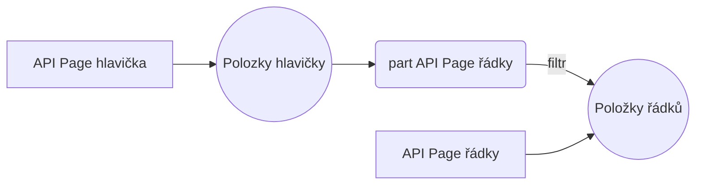

# Prolinkování API položek na API stránce

Stejně jako u [Datasetu](/Reports/Dataset.md) lze u [API Page](API%20page.md) položky prolinkovat do sebe. K tomu se, narozdíl od datasetu, používá klíčové slovo `part`. 

Dopsat, až na to budeme mít nějaký příklad.

# [Zadání tasku](https://navertica.visualstudio.com/BusinessCentral/_workitems/edit/92552/)

Na straně BC bude připraveno API, které umožní zpracovat zpětnou notifikaci o vyskladněném množství na prodejní objednávce. 
Endpoint bude mít následující strukturu: 


# Jak to bude fungovat

Zákazník chce mít v endpointu informace z prodejní objednávky - jak z **hlavičky**, tak samozřejmě **z řádků**. Postup bude obdobný jako u [datasetu](/Reports/Dataset.md) - do políček hlavičky vnoříme řádky. Způsob vnoření bude ale odlišný - budeme muset naprogramovat 2 API page - 1 pro hlavičku a 1 pro řádky. API page pro řádky pak vnoříme do API page pro hlavičku. 



# Struktura part
``` csharp
part(názevPoložky; názevAPIPage)
  {
      EntityName = položka;
      EntitySetName = položky;
      SubPageLink = určuje, podle čeho se přiřadí řádky ke kontrétní hlavičce;
      SubPageView = umožňuje filtrovat řádky;
  }
```

__**PermissionSet:**__

K api page musí vždy být vždycky permission set - [Jak vygenerovat PermissionSet](API%20page.md#PermissionSet)

``` csharp
permissionset 83775 "NVR AWC DHL Conn F"
{
    Caption = 'NVR AWC DLH Connector Full';
    Assignable = true;
    Permissions = codeunit "NVR AWC DHL Service" = X,
        page "NVR AWC Sales Order Lines API" = X,
        page "NVR AWC Sales Orders API" = X;
}
```

## API Page hlavičky
``` csharp
page 83775 "NVR AWC Sales Orders API"
{
    PageType = API;
    APIPublisher = 'navertica';
    APIGroup = 'dhl';
    APIVersion = 'v1.0';
    EntityName = 'order';
    EntitySetName = 'orders';
    SourceTable = "Sales Header";
    DelayedInsert = true;
    Editable = true;
    InsertAllowed = false;
    DeleteAllowed = false;
    ModifyAllowed = true;

    layout
    {
        area(Content)
        {
            repeater(control1)
            {
                field(orderNumber; Rec."NVR AWM DHL Order No.")
                {
                    Caption = 'DHL Order No.';
                }
                field(customerPurchaseOrderNumber; Rec."External Document No.")
                {
                    Caption = 'External Document No.';
                }
                field(id; Rec.SystemId)
                {
                    Caption = 'id', Locked = true;
                }
                field(lastModifiedDateTime; Rec.SystemModifiedAt)
                {
                    Caption = 'lastModifiedDateTime', Locked = true;
                }
                part(orderLines; "NVR AWC Sales Order Lines API")
                {
                    EntityName = 'orderLine';
                    EntitySetName = 'orderLines';
                    SubPageLink = "Document Type" = Field("Document Type"), "Document No." = Field("No.");
                    SubPageView = where(Type = const("Item"));
                }
            }
        }
    }

}
```

## API Page řádků
``` csharp
page 83776 "NVR AWC Sales Order Lines API"
{
    PageType = API;
    APIPublisher = 'navertica';
    APIGroup = 'dhl';
    APIVersion = 'v1.0';
    EntityName = 'orderLine';
    EntitySetName = 'orderLines';
    SourceTable = "Sales Line";
    DelayedInsert = true;
    Editable = true;
    InsertAllowed = false;
    DeleteAllowed = false;
    ModifyAllowed = true;

    layout
    {
        area(Content)
        {
            repeater(control1)
            {
                field(lineNumber; Rec."NVR AWM DHL Line No.")
                {
                    Caption = 'Line No.';
                }
                field(itemNumber; Rec."No.")
                {
                    Caption = 'No.';
                }
                field(shippedQuantity; Rec."NVR AWM DHL Picked Quantity")
                {
                    Caption = 'DHL Quantity Picked';
                }
                field(id; Rec.SystemId)
                {
                    Caption = 'id', Locked = true;
                }
                field(lastModifiedDateTime; Rec.SystemModifiedAt)
                {
                    Caption = 'lastModifiedDateTime', Locked = true;
                }
            }
        }
    }
}
```

