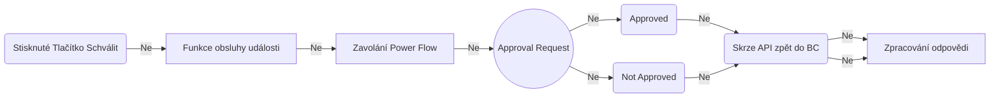

```mermaid
graph LR
A(Stisknuté Tlačítko Schválit) --Ne--> B[Funkce obsluhy události] -- Ne --> C[Zavolání Power Flow] -- Ne --> D((Approval Request))
D -- Ne --> E(Approved) -- Ne --> G(Skrze API zpět do BC) -- Ne --> H[Zpracování odpovědi]
D -- Ne --> F(Not Approved) -- Ne --> G -- Ne --> H
```
