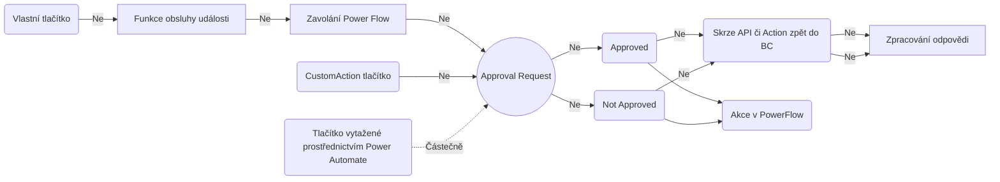

```mermaid
graph LR
A(Vlastní tlačítko) --Ne--> B[Funkce obsluhy události] -- Ne --> C[Zavolání Power Flow] -- Ne --> D((Approval Request))
D -- Ne --> E(Approved) -- Ne --> G(Skrze API či Action zpět do BC) -- Ne --> H[Zpracování odpovědi]
D -- Ne --> F(Not Approved) -- Ne --> G -- Ne --> H
E --> K(Akce v PowerFlow)
F --> K

I(CustomAction tlačítko) -- Ne --> D

J(Tlačítko vytažené prostřednictvím Power Automate) -. Částečně .-> D


```
