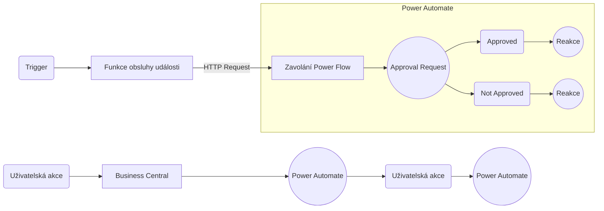

```mermaid
graph LR


subgraph ide1 [Power Automate]
C[Zavolání Power Flow]  --> D((Approval Request))
D --> E(Approved) --> G((Reakce))
D --> F(Not Approved) --> H((Reakce))
end

A(Trigger) --> B[Funkce obsluhy události] -- HTTP Request --> C

I(Uživatelská akce) --> J[Business Central] --> K((Power Automate)) --> L(Uživatelská akce) --> M((Power Automate))
```
