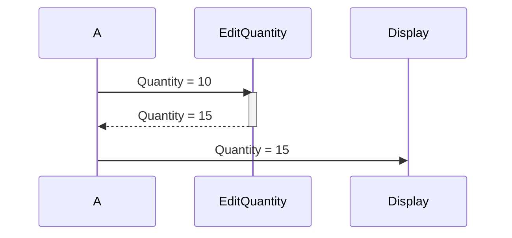
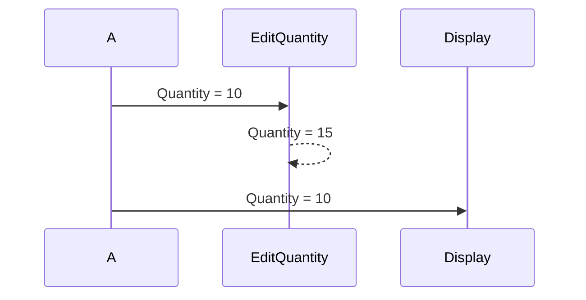

# Mám dát do parametrů procedury parametr s var nebo bez var?

**Pro příklad si představme jednoduchý kód** (PS: Kód je celý smyšlený)**:**

``` csharp
var
    Quantity: Integer;
    QuantityOperations: Codeunit "Quantity Operations";
begin
    Quantity := 10;
    QuantityOperations.EditQuantity(Quantity);
    print(Quantity);
end;
```

# Parametr s var
> Jako parametr předávám odkaz na proměnnou/záznam v tabulce.

Předávám tedy nějakou adresu, kde se hodnota nachází. Procedura hodnotu může nějak upravit a "vrátí ji". To znamená, že pokud já z místa A zavolám proceduru, která se nachází v nějaké CU, a jako parametr ji předám odkaz na Quantity (Quantity = 10), tak pokud ji procedura na místě B (CodeUnita) svou vnitřní logikou upraví na 15, tak já při dalším vykonávání kódu pracuji s hodnotou Quantity = 15.

``` csharp
internal procedure EditQuantity(var Quantity: Integer)
var
    Payload: Integer;
begin
    Payload := 5;
    Quantity += Payload;
end;
```



# Parametr bez var
> Jako parametr předávám hodnotu proměnné/záznamu v tabulce.

Předávám pouze hodnotu. Procedura hodnotu může nějak upravit, ale já se k upravené hodnotě nedostanu. To znamená, že pokud já z místa A zavolám proceduru, a jako parametr ji předám hodnotu Quantity (Quantity = 10), tak pokud ji procedura na místě B (CodeUnita) svou vnitřní logikou upraví na 15, tak já při dalším vykonávání kódu pracuji stále s hodnotou Quantity = 10.

``` csharp
internal procedure EditQuantity(Quantity: Integer)
var
    Payload: Integer;
begin
    Payload := 5;
    Quantity += Payload;
end;
```


