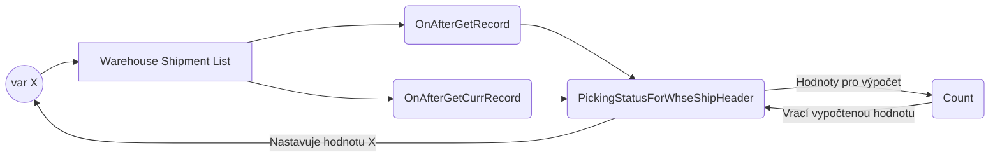

# Vypočítané pole

Pokud potřebuji mít na stránce nějakou hodnotu/políčko, pro které nepotřebuji/nechci vytvářet záznam v tabulce, mohu na stránce zobrazit políčko, které je vyjádřené pomocí **proměnné**.
>- Podle tohoto pole nemohu filtrovat
>- Hodnotu tohoto pole nemohu použít mimo danou page
>- Využívá se velmi často
>- Jednodušší implementace, než druhý způsob (viz. konec kapitoly)
>- **_PS: O způsobu implementace (vyjádření pomocí proměnné vs. klasický záznam v tabulce je vhodné se poradit se Senior Programátorem)_**


# Zadání tasku (výtah)

Do hlavičky dodávky ze skladu(i na přehled přidáme) nové pole - **Stav vychystávání**. Bude filtrovat do řádků skladových dodávek, na typ původu, podtyp původu a číslo původu. Pole bude obsahovat výpočet:
**Stav vychystávání** = Dodané Množství/Množství * 100 přes všechny zafiltrované řádky.

> V tomto případě nelze využít kalkulované pole, neboť je hodnutu nutné vypočítat určitým vzorcem. 

# Jak to bude fungovat

Zvolíme implementaci prostřednictvím vypočítaného políčka, které se bude zobrazovat pouze na konkrétních stránkách. **Nebudeme** tedy **vytvářet políčko (záznam) v tabulce**, jak jsme zvyklí. Na stránce vytvoříme proměnnou, kterou necháme zobrazit v políčku na této stránce. Na stránku přidáme triggery, při kterých dojde k vypočítání hodnoty této proměnné, jenž bude následně zobrazena.

Pro výpočet potřebujeme získat dodané množství a celkové množství, které má být dodáno. Tyto informace jsou naštěstí na řádcích dodávky ze skladu, čímž se nám vše opět zjednoduší. Pro danou hlavičku dodávky ze skladu pomocí filrů najdeme všechny řádky dodávky ze skladu. Ty pak projdeme a sečteme požadované hodnoty. 




## Vytvoření datasetu (reportu)
Je třeba si připomenout, že pouze "vytahujeme" data z BC, neděláme žádný layout. Data, která budou v datasetu obsažena, definujeme v **dataset**
``` csharp
report  78958  "Export Posted S. Ship. Lines"
{
    UsageCategory = ReportsAndAnalysis;
    ApplicationArea = All;
    Caption = 'Export Posted Sales Shipment Lines';
    dataset
    {
```


### Položky hlavičky prodejní dodávky

Množina záznamů z určité tabulky je vždy přístupná skrze **dataitem**. Vlastnost ***RequestFilterFields*** určuje právě ty 3 parametry, které mají být nastaveny jako výchozí pro filtrování - objeví se na tzv. **request page**. Následně jsou implementována jednotlivá políčka z hlavičky prodejní dodávky, která mají být v datasetu obsažena. **Všimni si, že dataitem není uzavřený, neboť do něj bude vnořen dataitem řádku!**

Zároveň je žádoucí vlastnost **PrintOnlyIfDetail**, která zaručí, že daná hlavička nebude zahrnuta do reportu, když budou její "děti" (=řádky) prázdné. Daná hlavička bude přeskočena a report bude pokračovat dále.
``` csharp
	dataitem("Sales Shipment Header"; "Sales Shipment Header")
	{
		RequestFilterFields = "Order No.", "Sell-to Customer No.", "Posting Date";
		PrintOnlyIfDetail = true;

		column(OrderNo_SalesShipmentHeader; "Order No.")
		{
			IncludeCaption = true;
		}
		column(YourReference_SalesShipmentHeader; "Your Reference")
		{
			IncludeCaption = true;
		}
		column(No_SalesShipmentHeader; "No.")
		{
			IncludeCaption = true;
		}
		column(PostingDate_SalesShipmentHeader; "Posting Date")
		{
			IncludeCaption = true;
		}
		column(DocumentDate_SalesShipmentHeader; "Document Date")
		{
			IncludeCaption = true;
		}
```

#### Request page


### Položky řádků prodejní dodávky

Dataitem řádku je **vnořen** do dataitemu hlavičky prodejní dodávky, protože chceme, aby algoritmus pro každou hlavičku prodejní dodávky prošel řádky, které patří ke konkrétní hlavičce. Kromě samotného vnoření **je nezbytné nastavit ještě další vlastnosti:**

 - ***DataItemLinkReference*** - na jakou tabulku se odkazujeme --> Hlavička prodejní dodávky
 - ***DataItemLink*** - podle čeho "párujeme" --> Řádky jsou k hlavičce přiřazeny prostřednictvím políčka Document No., které se shoduje s polem No. hlavičky

Nesmíme zapomenout, že v **datasetu chceme pouze řádky**, na kterých je nějaké **zboží s množstvím větším než 0**. Proto nastavujeme filtr prostřednictvím:

 - ***DataItemTableView***

**Opět si všimni, že dataitem není uzavřený, neboť dojde ještě k jednomu vnoření!**

``` csharp
		dataitem("Sales Shipment Line"; "Sales Shipment Line")
		{
			DataItemLinkReference = "Sales Shipment Header";
			DataItemLink = "Document No." = field("No.");
			DataItemTableView = where(Quantity = filter(> 0), Type = const("Item"));

			column(NVRLVDDMDrumBundleNo_SalesShipmentLine; "NVR LVDDM Drum/Bundle No.")
			{
				IncludeCaption = true;
			}
			column(UnitofMeasure_SalesShipmentLine; "Unit of Measure")
			{
				IncludeCaption = true;
			}
			column(No_SalesShipmentLine; "No.")
			{
				IncludeCaption = true;
			}
			column(Quantity_SalesShipmentLine; Quantity)
			{
				IncludeCaption = true;
			}
```

### Položky z karty zboží

Protože chceme v datasetu i políčko itemCommonNo (obecné číslo z karty zboží), musíme se podívat na kartu zboží, neboť toto políčko není vytažené na řádku prodejní dodávky. Princip je stejný, jako u řádků prodejní dodávky. Pokud řádek v předchozím kroku projde "filtrem" (je typu zboží s množstvím větším než 0), tak pro zboží, které obsahuje, vyhledáme na kartě (tohoto) zboží políčko itemCommonNo.

``` csharp
			dataitem(Item; Item)
			{
				DataItemLinkReference = "Sales Shipment Line";
				DataItemLink = "No." = field("No.");

				column(CommonItemNo_Item; "Common Item No.")
				{
					IncludeCaption = true;
				}
			}
```

# Celý kód
``` csharp
report  78958  "Export Posted S. Ship. Lines"
{
	UsageCategory = ReportsAndAnalysis;
	ApplicationArea = All;
	Caption = 'Export Posted Sales Shipment Lines';

	dataset
	{
		dataitem("Sales Shipment Header"; "Sales Shipment Header")
		{
			RequestFilterFields = "Order No.", "Sell-to Customer No.", "Posting Date";
			PrintOnlyIfDetail = true;
			
			column(OrderNo_SalesShipmentHeader; "Order No.")
			{
				IncludeCaption = true;
			}
			column(YourReference_SalesShipmentHeader; "Your Reference")
			{
				IncludeCaption = true;
			}
			column(No_SalesShipmentHeader; "No.")
			{
				IncludeCaption = true;
			}
			column(PostingDate_SalesShipmentHeader; "Posting Date")
			{
				IncludeCaption = true;
			}
			column(DocumentDate_SalesShipmentHeader; "Document Date")
			{
				IncludeCaption = true;
			}

  

			dataitem("Sales Shipment Line"; "Sales Shipment Line")
			{
				DataItemLinkReference = "Sales Shipment Header";
				DataItemLink = "Document No." = field("No.");
				DataItemTableView = where(Quantity = filter(> 0), Type = const("Item"));

				column(NVRLVDDMDrumBundleNo_SalesShipmentLine; "NVR LVDDM Drum/Bundle No.")
				{
					IncludeCaption = true;
				}
				column(UnitofMeasure_SalesShipmentLine; "Unit of Measure")
				{
					IncludeCaption = true;
				}
				column(No_SalesShipmentLine; "No.")
				{
					IncludeCaption = true;
				}
				column(Quantity_SalesShipmentLine; Quantity)
				{
					IncludeCaption = true;
				}

				dataitem(Item; Item)
				{
					DataItemLinkReference = "Sales Shipment Line";
					DataItemLink = "No." = field("No.");

					column(CommonItemNo_Item; "Common Item No.")
					{
						IncludeCaption = true;
					}
				}
			}
		}
	}
}
