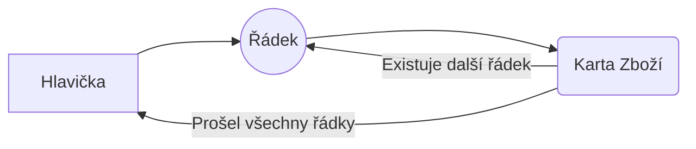

# Dataset

Dataset je typ reportu, u kterého pouze generuji data, ale **nestarám se o layout**. Layout si řeší zákazník nebo se použije nějaký výchozí layout v BC.

# Zadání tasku

Pro jednoho zákazníka exportuje LANA do Excelu jeho dodávky (v podstatě taková zjednodušená forma EDI).

Bude tedy nutné vytvořit report, který bude volaný nad řádky účtovaných prodejních dodávek - **na request page reportu budou přednastaveny filtry na:**

>-   Číslo zákazníka (Sell-To)
>-   Číslo dokladu (číslo účtované prodejní dodávky)
>-   Zúčtovací datum (z hlavičky dodávky)

Na ostatní pole z řádku účtované prodejní dodávky by měla být možnost filtrování dobrovolná.

>**Exportovat se budou všechny řádky účtované prodejní dodávky, které jsou na zboží a které mají množství > 0.**

Dataset reportu bude obsahovat následující informace:

-   salesShipmentNo (číslo účtované prodejní dodávky)
-   postingDate (zúčtovací datum z účtované prodejní dodávky)
-   documentDate (datum dokladu z účtované prodejní dodávky)
-   itemCommonNo (obecné číslo z karty zboží)
-   itemNo (číslo zboží z řádku účtované prodejní dodávky)
-   quantity (množství z řádku účtované prodejní dodávky)
-   yourReference (Vaše reference z hlavičky účtované prodejní dodávky)
-   orderNo (číslo objednávky z hlavičky účtované prodejní dodávky)
-   drumNo (číslo bubnu)
-   unitOfMeasure (měrná jednotka z řádku účtované prodejní dodávky)

Layout reportu v Excelu by mělo být možné vytvořit pomocí standardních nástrojů v BC.

# Jak to bude fungovat

Report bude možné spouštět přes funkci vyhledat (lupa nahoře). Zobrazí se 3 přednastavené filtry, pomocí kterých může zákazník nafiltrovat zůčtované prodejní dodávky. Prodejní dodávka se skládá ze:

-   Hlavičky
-   Řádků
	- Na řádcích jsou pak jednotlivé položky
	- Do datasetu chceme:
		- Řádky **typu zboží** s **množstvím větším než 0**

Podle nastavených filtrů budou procházeny jednotlivé hlavičky zůčtovaných prodejních dodávek. Pro každou hlavičku musí dojít k projití všech jejich řádků, proto dojde ke **vnoření** *(zapamatuj si, uvidíš v kódu)*



## Vytvoření datasetu (reportu)
Je třeba si připomenout, že pouze "vytahujeme" data z BC, neděláme žádný layout. Data, která budou v datasetu obsažena, definujeme v **dataset**
``` csharp
report  78958  "Export Posted S. Ship. Lines"
{
    UsageCategory = ReportsAndAnalysis;
    ApplicationArea = All;
    Caption = 'Export Posted Sales Shipment Lines';
    dataset
    {
```


### Položky hlavičky prodejní dodávky

Množina záznamů z určité tabulky je vždy přístupná skrze **dataitem**. Vlastnost ***RequestFilterFields*** určuje právě ty 3 parametry, které mají být nastaveny jako výchozí pro filtrování. Následně jsou implementována jednotlivá políčka z hlavičky prodejní dodávky, která mají být v datasetu obsažena. **Všimni si, že dataitem není uzavřený, neboť do něj bude vnořen dataitem řádku!**
``` csharp
	dataitem("Sales Shipment Header"; "Sales Shipment Header")
	{
		RequestFilterFields = "Order No.", "Sell-to Customer No.", "Posting Date";
		column(OrderNo_SalesShipmentHeader; "Order No.")
		{
			IncludeCaption = true;
		}
		column(YourReference_SalesShipmentHeader; "Your Reference")
		{
			IncludeCaption = true;
		}
		column(No_SalesShipmentHeader; "No.")
		{
			IncludeCaption = true;
		}
		column(PostingDate_SalesShipmentHeader; "Posting Date")
		{
			IncludeCaption = true;
		}
		column(DocumentDate_SalesShipmentHeader; "Document Date")
		{
			IncludeCaption = true;
		}
```

### Položky řádků prodejní dodávky

Dataitem řádku je **vnořen** do dataitemu hlavičky prodejní dodávky, protože chceme, aby algoritmus pro každou hlavičku prodejní objednávky prošel řádky, které patří ke konkrétní hlavičce. Kromě samotného vnoření **je nezbytné nastavit ještě další vlastnosti:**

 - ***DataItemLinkReference*** - na jakou tabulku se odkazujeme --> Hlavička prodejní dodávky
 - ***DataItemLink*** - podle čeho "párujeme" --> Řádky jsou k hlavičce přiřazeny prostřednictvím políčka Document No., které se shoduje s polem No. hlavičky

Nesmíme zapomenout, že v **datasetu chceme pouze řádky**, na kterých je nějaké **zboží s množstvím větším než 0**. Proto nastavujeme filtr prostřednictvím:

 - ***DataItemTableView***

**Opět si všimni, že dataitem není uzavřený, neboť dojde ještě k jednomu vnoření!**

``` csharp
		dataitem("Sales Shipment Line"; "Sales Shipment Line")
		{
			DataItemLinkReference = "Sales Shipment Header";
			DataItemLink = "Document No." = field("No.");
			DataItemTableView = where(Quantity = filter(> 0), Type = const("Item"));

			column(NVRLVDDMDrumBundleNo_SalesShipmentLine; "NVR LVDDM Drum/Bundle No.")
			{
				IncludeCaption = true;
			}
			column(UnitofMeasure_SalesShipmentLine; "Unit of Measure")
			{
				IncludeCaption = true;
			}
			column(No_SalesShipmentLine; "No.")
			{
				IncludeCaption = true;
			}
			column(Quantity_SalesShipmentLine; Quantity)
			{
				IncludeCaption = true;
			}
```

### Položky z karty zboží

Protože chceme v datasetu i políčko itemCommonNo (obecné číslo z karty zboží), musíme se podívat na kartu zboží, neboť toto políčko není vytažené na řádku prodejní dodávky. Princip je stejný, jako u řádků prodejní dodávky. Pokud řádek v předchozím kroku projde "filtrem" (je typu zboží s množstvím větším než 0), tak pro zboží, které obsahuje, vyhledáme na kartě (tohoto) zboží políčko itemCommonNo.

``` csharp
			dataitem(Item; Item)
			{
				DataItemLinkReference = "Sales Shipment Line";
				DataItemLink = "No." = field("No.");
				column(CommonItemNo_Item; "Common Item No.")
				{
					IncludeCaption = true;
				}
			}
```

# Celý kód
``` csharp
report  78958  "Export Posted S. Ship. Lines"
{
	UsageCategory = ReportsAndAnalysis;
	ApplicationArea = All;
	Caption = 'Export Posted Sales Shipment Lines';

	dataset
	{
		dataitem("Sales Shipment Header"; "Sales Shipment Header")
		{
			RequestFilterFields = "No.", "Order No.", "Sell-to Customer No.", "Posting Date";
			
			column(OrderNo_SalesShipmentHeader; "Order No.")
			{
				IncludeCaption = true;
			}
			column(YourReference_SalesShipmentHeader; "Your Reference")
			{
				IncludeCaption = true;
			}
			column(No_SalesShipmentHeader; "No.")
			{
				IncludeCaption = true;
			}
			column(PostingDate_SalesShipmentHeader; "Posting Date")
			{
				IncludeCaption = true;
			}
			column(DocumentDate_SalesShipmentHeader; "Document Date")
			{
				IncludeCaption = true;
			}

  

			dataitem("Sales Shipment Line"; "Sales Shipment Line")
			{
				DataItemLinkReference = "Sales Shipment Header";
				DataItemLink = "Document No." = field("No.");
				DataItemTableView = where(Quantity = filter(> 0), Type = const("Item"));

				column(NVRLVDDMDrumBundleNo_SalesShipmentLine; "NVR LVDDM Drum/Bundle No.")
				{
					IncludeCaption = true;
				}
				column(UnitofMeasure_SalesShipmentLine; "Unit of Measure")
				{
					IncludeCaption = true;
				}
				column(No_SalesShipmentLine; "No.")
				{
					IncludeCaption = true;
				}
				column(Quantity_SalesShipmentLine; Quantity)
				{
					IncludeCaption = true;
				}

				dataitem(Item; Item)
				{
					DataItemLinkReference = "Sales Shipment Line";
					DataItemLink = "No." = field("No.");

					column(CommonItemNo_Item; "Common Item No.")
					{
						IncludeCaption = true;
					}
				}
			}
		}
	}
}
```
